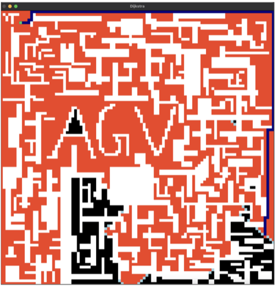

# Global Path Planning Algoritms

Analysis of Path Finding Algorithms based on their cost and time taken.

## Usage

```bash
git clone https://github.com/mradul2/path-planning-algorithms.git
python3 algorithm.py
```

### Available Algorithms

- AstarAdmissible
- AstarAdmissible2
- AstarDiagonal
- AstarDiagonal2
- AstarEuclidean
- AstarEuclidean2
- AstarManhattan
- AstarManhattan2
- AstarNonAdmissible
- AstarNonAdmissible2
- Dijkstra
- Dijkstra2

## Results

Cost of the Path found by the respective algorithms (1 pixel = 1 unit)


Execution Time taken by each of the algorithm (In seconds)


### Analysis


### Outputs

#### Dijkstra.py



#### Dijkstra2.py


#### AstarAdmissible.py


#### AstarAdmissible2.py


#### AstarNonAdmissible.py


#### AstarNonAdmissible2.py


#### AstarDiagonal.py


#### AstarDiagonal2.py


#### AstarManhattan.py


#### AstarManhattan2.py


#### AstarEuclidean.py


#### AstarEuclidean2.py


### Color code

| Node       | Colour |
|------------|--------|
| FINAL PATH | Blue   |
| CLOSED     | Orange |
| OPEN       | Gray   |
| OBSTACLE   | White  |
| MOVABLE    | Black  |
| START      | Green  |
| END        | Red    |

## About

`node.py` file contains a `Node` class along with functions for Constructing Path, Generating Neighbours of a Node, Checking for a valid Node, Calculating heuristic with different heuristic functions.

With the help of `Node` class, A matrix similar to the given image is created with elements as Nodes. And then a further appropriate algorithm is applied to these Nodes containing matrices. Which is finally translated into the given Image for demonstration. 

`utils.py` is a utility file with some Global constants including the given Image and some utility functions such as upScale used for upscaling the given Image.

There are 12 different algorithm files which on running in the terminal will give the Final Image containing `Path`, `Open Nodes`, `Closed Nodes` and `Unvisited Nodes` along with the time taken by the algorithm and cost of the path.
